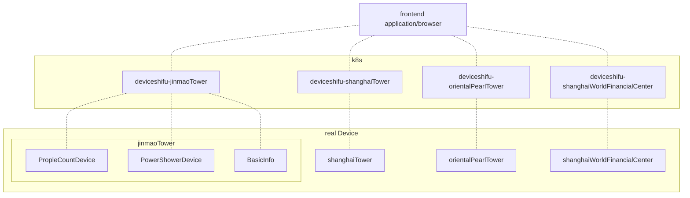

# [Shifu](https://github.com/Edgenesis/shifu) + [Lingo3D Smart City](https://github.com/lingo3d/example-vue-smart-city) demo

## Step1: Bring up *Kind*:

```bash
cat <<EOF | kind create cluster --config=-
kind: Cluster
apiVersion: kind.x-k8s.io/v1alpha4
nodes:
- role: control-plane
  kubeadmConfigPatches:
  - |
    kind: InitConfiguration
    nodeRegistration:
      kubeletExtraArgs:
        node-labels: "ingress-ready=true"
  extraPortMappings:
  - containerPort: 80
    hostPort: 40080
    protocol: TCP
  - containerPort: 443
    hostPort: 443
    protocol: TCP
EOF
```

## Step2: Pre pull containers:

```bash
docker pull registry.k8s.io/ingress-nginx/controller:v1.3.1
docker pull registry.k8s.io/ingress-nginx/kube-webhook-certgen:v1.3.0
kind load docker-image registry.k8s.io/ingress-nginx/controller:v1.3.1
kind load docker-image registry.k8s.io/ingress-nginx/kube-webhook-certgen:v1.3.0
```

## Step3: Build frontend and virtual devices:

```bash
make build-mock-device-image
make kind-load-mock-device
```

## Step4: Install Shifu

```bash
make install-shifu
```

## Step5: Deploy frontend, ingress, deviceShifu and virtual devices:

```bash
make start-mockdevice-and-devicehsifu
kubectl apply -f demo-device/conf/deploy.yaml
kubectl apply -f demo-device/conf/ingress.yaml
```

## Step6: navigate to URL (localhost by default)

```bash
http://localhost/smartcity
```

# Arch Graph

